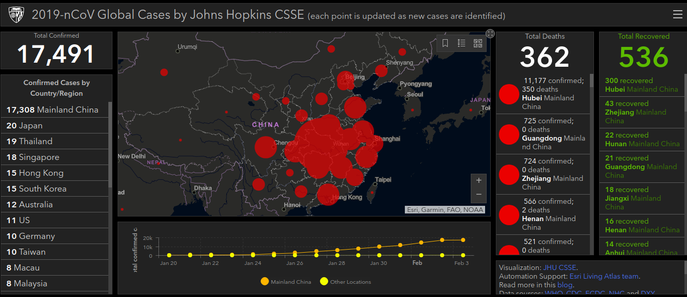

# Tracking the Spread of Coronavirus?
**Coronaviruses** are a family of viruses known for containing strains that cause potentially deadly diseases in mammals and birds. In humans they're typically spread via airborne droplets of fluid produced by infected individuals.Some rare but notable strains, including Wuhan coronavirus (2019-nCoV), and those responsible for severe acute respiratory syndrome (SARS) and Middle East respiratory syndrome (MERS), can cause death in humans.[See More](https://www.sciencealert.com/coronavirus)

## Coronavirus Dataset
The 2019-nCoV is a contagious coronavirus that hailed from Wuhan, China. This new strain of virus has striked fear in many countries as cities are quarantined and hospitals are overcrowded. This dataset will help us understand how 2019-nCoV is spread aroud the world.

[See More](https://www.kaggle.com/brendaso/2019-coronavirus-dataset-01212020-01262020#2019_nC0v_20200121_20200126%20-%20SUMMARY.csv)

## About this dataset
This file is an aggregated version of the 2019-nCoV dataset collected by Johns Hopkins University.

## Johns Hopkins University Dashboard

## Analysis of Cases : State of China 
### Confirmed 

### Recovered

### Suspected

### Deaths

## Time Evolution: State of China 
### Confirmed

### Recovered

### Suspected 

### Deaths 

## Technology That I Used
- Python3 
- NumPy
- Matplotlib
- Seaborn 
- Pandas